# 一、MySQL数据库的安装（如果安装失败请看7）

<font color='red'>**注意：**</font>

<font color='red'>**必须用系统管理员身份运行mysql安装程序。**</font>

<font color='red'>**安装目录切记不要用中文。**</font>


## 步骤一：双击mysql8的安装向导


## 步骤二：分为首次安装和再安装

### 1、首次安装

#### （1）如果是首次安装mysql系列的产品，需要先安装mysql产品的安装向导


#### （2）选择安装模式


### 2、不是首次安装

#### （1）取消更新（如果电脑上有mysql相关软件才有）

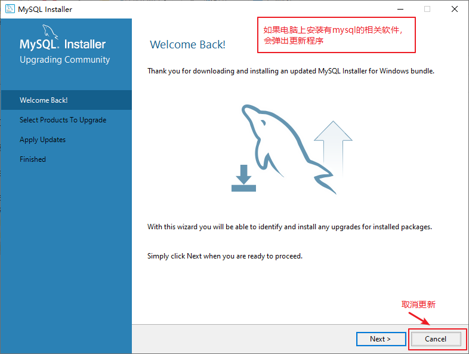


#### （2）选择Add安装


## 步骤三：选择要安装的产品


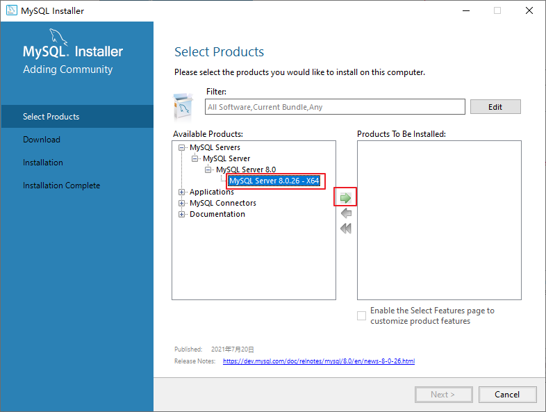

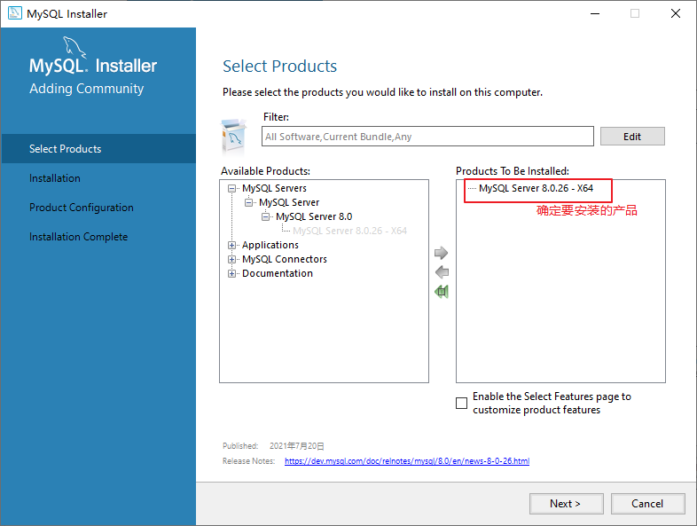

## 步骤四：设置软件安装目录<font color='red'>（切记服务安装目录不要有中文字符，否则有问题）</font>

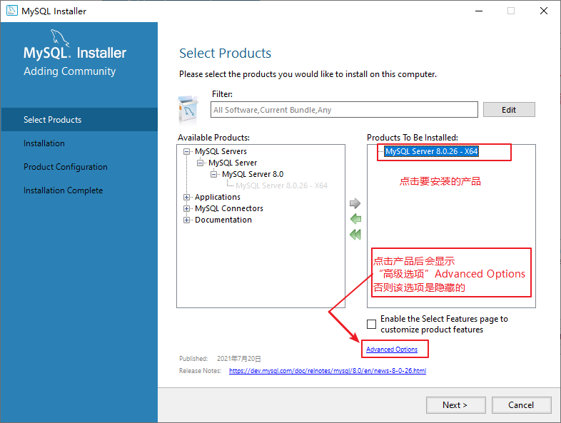


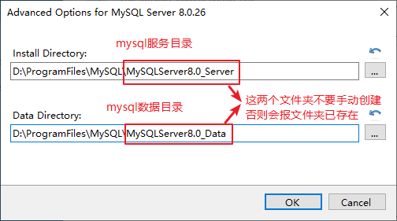

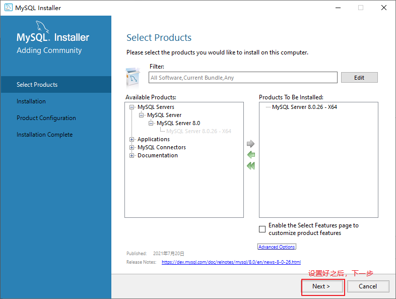

## 步骤五：执行安装


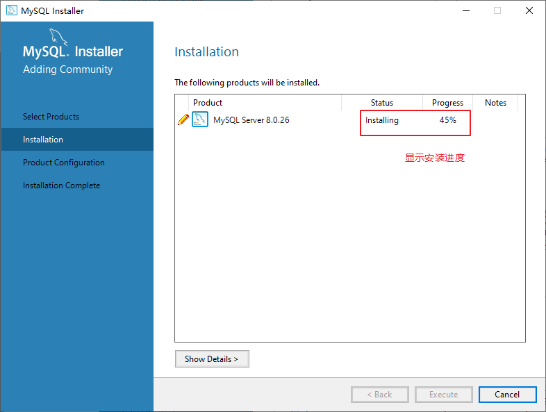

## 步骤六：完成安装


## 步骤七：准备设置


# 二、MySQL实例初始化和设置

## 步骤一：选择安装的电脑类型、设置端口号

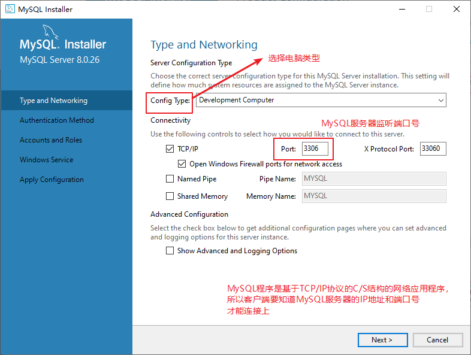

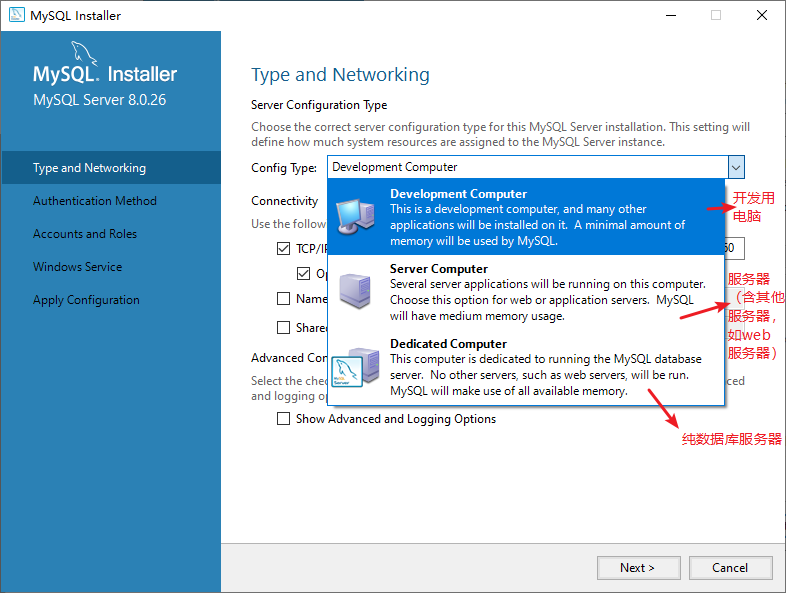

## 步骤二：选择mysql账号密码加密规则

在MySQL 5.x中默认的身份认证插件为“mysql_native_password”。

在MySQL 8.x中，默认的身份认证插件是“caching_sha2_password”，替代了之前的“mysql_native_password”。

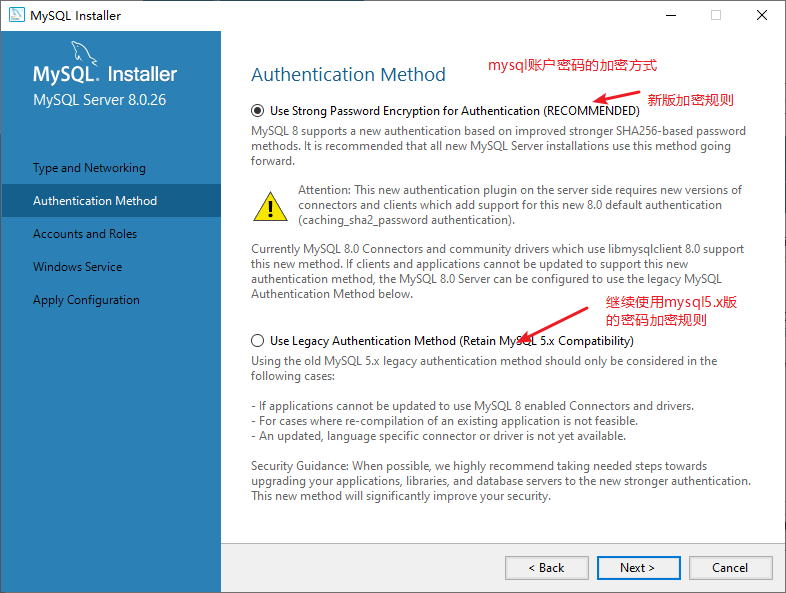

## 步骤三：设置root账户密码

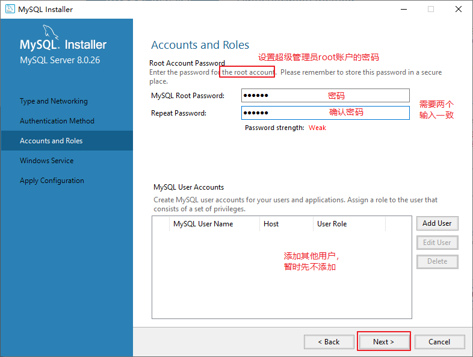

## 步骤四：设置mysql服务名和服务启动策略

如果电脑上可能安装多个版本mysql，请在服务名后面保留版本标识，例如：MySQL80，这样可以区别用哪个版本的mysql

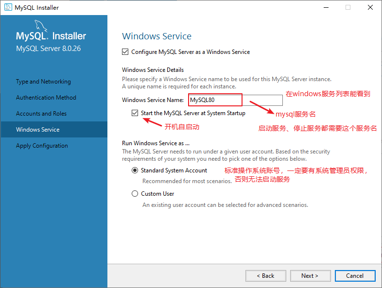

## 步骤五：执行设置（初始化mysql实例）


## 步骤六：完成设置


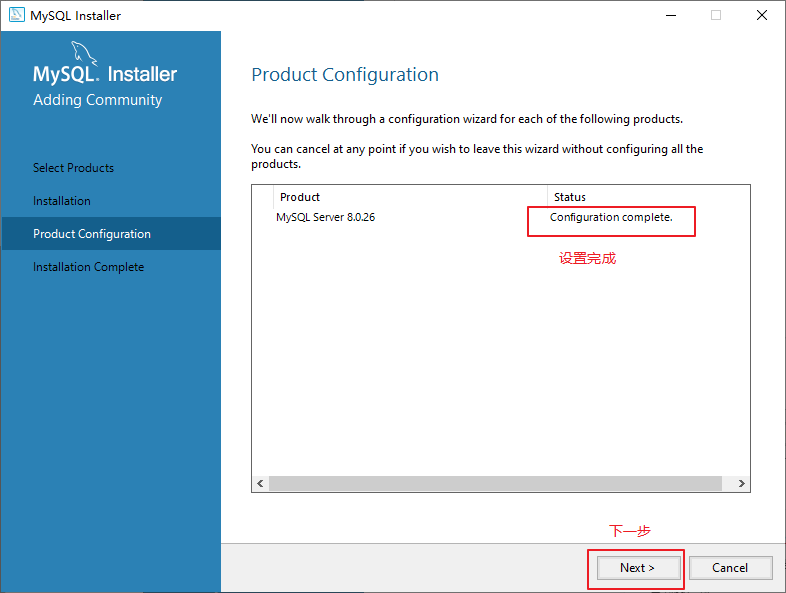


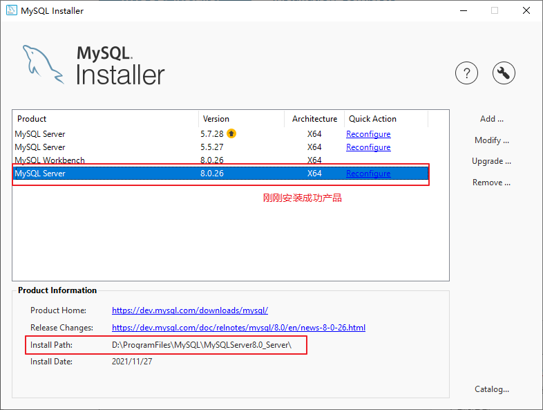

# 三、MySQL数据库服务的启动和停止

MySQL软件的服务器端必须先启动，客户端才可以连接和使用使用数据库。

如果接下来天天用，可以设置自动启动。

## 方式一：图形化方式

* 计算机（点击鼠标右键）》管理（点击）》服务和应用程序（点击）》服务（点击）》MySQL80（点击鼠标右键）==》启动或停止（点击）
* 控制面板（点击）》系统和安全（点击）》管理工具（点击）》服务（点击）》MySQL80（点击鼠标右键）==》启动或停止（点击）
* 任务栏（点击鼠标右键）》启动任务管理器（点击）》服务（点击）》MySQL80（点击鼠标右键）》启动或停止（点击）

## 方式二：命令行方式

必须是系统管理员才能运行下面的命令。

```cmd
启动 MySQL 服务命令：
net start MySQL80

停止 MySQL 服务命令：
net stop MySQL80
```

# 四、MySQL数据库环境变量的配置

如果运行mysql命令，报错如下错误，说明需要配置环境变量

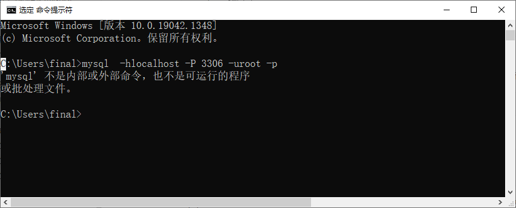


| 环境变量名 | 操作 |                 环境变量值                  |
| :--------: | :--: | :-----------------------------------------: |
| MYSQL_HOME | 新建 | D:\ProgramFiles\MySQL\MySQLServer8.0_Server |
|    path    | 编辑 |              %MYSQL_HOME%\bin               |

或者直接

| 环境变量名 | 操作 |                   环境变量值                    |
| :--------: | :--: | :---------------------------------------------: |
|    path    | 编辑 | D:\ProgramFiles\MySQL\MySQLServer8.0_Server\bin |

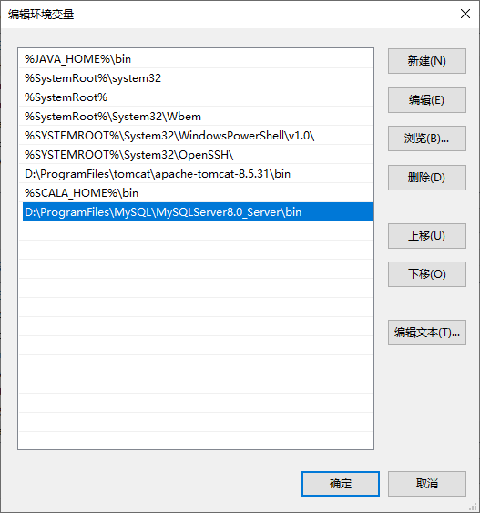
