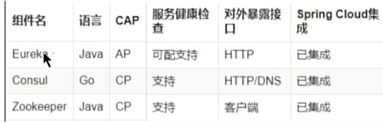

微服务springcloud第3季当堂代码2024.1
# 技术介绍
服务注册与发现：Consul，Alibaba Nacos
服务调用和负载均衡：RestTemplate，OpenFeign
分布式事务：Seata
服务熔断和降级：CircuitBreaker（Resilience4j），Alibaba Sentinel
服务网关：Spring Cloud Gateway
服务配置：Consul，Alibaba Nacos

# 项目结构介绍
1. cloud-api-commons：
对外暴露通用的组件，统一实体对象，api，接口，工具类，全局异常，等
maven命令clean install 然后打成jar包，然后在其他项目中引入这个jar包的坐标

5. cloud-consumer-feign-order80：
演示了OpenFeign，CircuitBreaker断路器(Resilience4j)

3. cloud-consumer-order80：
演示了RestTemplate，服务注册进consul，Micrometer+ZipKin搭建链路监控

5. cloud-gateway9527：
演示了Gateway，3个主要的，路由断言过滤，统计接口性能，自定义filter

1. cloud-provider-payment8001：
演示了（服务注册进consul），consul的分布式配置管理，导入Micrometer+ZipKin的依赖

1. cloud-provider-payment8002：
作为第二个支付服务，演示了consul的负载均衡

8. cloudalibaba-config-nacos-client3377：
演示了nacos配置管理，namespace，group，dataId等

6. cloudalibaba-consumer-nacos-order83：
演示了spring cloud alibaba的一些信息，nacos服务消费

7. cloudalibaba-provider-payment9001：
演示了服务注册进nacos

10. cloudalibaba-sentinel-gateway9528：
演示了通过gateway网关整合sentinel

11. cloudalibaba-sentinel-service8401：
演示了sentinel介绍，限流，熔断，降级等，规则持久化，授权规则，热点规则，熔断规则，流控效果，流控模式，整合openfeign等

15. mybatis_generator2024：
无，改两个配置文件，然后运行插件生成

14. seata-account-service2003：
无

12. seata-order-service2001：
演示了seata分布式事务介绍，RM，TM，TC，实现分布式事务（AT模式）

13. seata-storage-service2002：
无

# 引入服务注册与发现

## consul和nacos的配置文件中不同
Consul的服务发现机制：
- Consul使用服务名称直接进行服务发现
- 在使用RestTemplate或Feign时，直接使用服务名称即可
- Consul的这种方式更简单，遵循Spring Cloud的默认服务发现规则

Nacos的服务发现机制：
- Nacos提供了更灵活的配置方式
- 通过service-url的配置，可以：
- 自定义服务调用的完整URL
- 支持不同环境下的服务地址配置
- 便于管理多个服务之间的调用关系

## 为什么需要服务注册与发现？

在微服务架构中，硬编码服务地址和端口号会带来以下问题：

1. 服务地址变更问题
- 如果订单服务和支付服务的IP地址或端口号发生变化，支付服务将无法使用
- 需要手动修改订单服务中调用支付服务的IP地址和端口号
- public static final String PaymentSrv_URL = "http://localhost:8001"; //硬编码，不推荐

2. 负载均衡问题
- 如果系统中部署了多个订单服务和支付服务，无法实现服务的负载均衡功能

3. 扩展性问题
- 如果系统需要支持更高的并发，需要部署更多的订单服务和支付服务
- 硬编码的订单服务在后续维护中会变得异常复杂

因此，在微服务开发过程中，需要引入服务治理功能，实现微服务之间的动态注册与发现，从而正式进入SpringCloud实战阶段。

## 三种微服务的cap对比
AP：高可用性，分区容错性，牺牲一致性  多个服务器中，有不同步的情况，依然会返回

CP：一致性，分区容错性，牺牲可用性  多个服务器中，有不同步的情况，会返回错误

# 1
