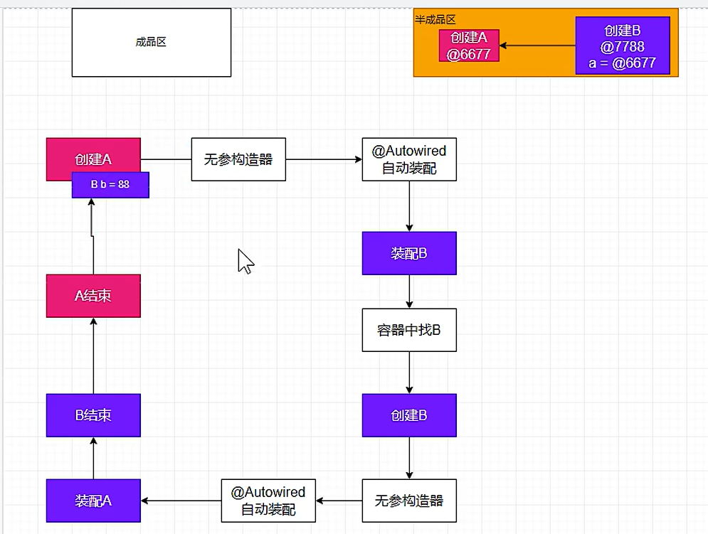
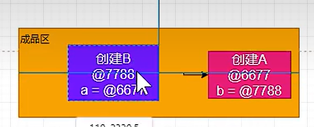

# 容器

先看main方法的所有，再看注释

```markdown
xx bean=ioc.getBean(xx.class)
xx bean=ioc.getBeansOfType(xx.class)
xx bean=ioc.getBean("zhangsan", Person.class);
ConfigurableApplicationContext ioc=xx;
@configuration
@Controller@Service@Repository@Component
@Scope@Lazy@Bean
@Conditional
@Autowire
@Resource
@primary
@Qualifier
@Value
构造器注入set注入
ResourceUtils获取配置文件内容
@Profile
FactoryBean接口和重写3个方法
@Bean
```

# 生命周期+aop

直接看main方法的注释

```markdown
new ClassPathXmlApplicationContext
Bean生命周期
postProcessBeforeInitialization
AutowiredAnnotationBeanPostProcessor
InitializingBean
@Bean.init
postProcessAfterInitialization
@PreDestroy
DisposableBean.destroy()
@Bean.destroy
@Autowired是如何实现的？
自定义@UUID然后自动扫描到这个注解自动赋值
依赖倒置
@Aspect
@Component
@Before
@After
@AfterReturning
@AfterThrowing
execution
args
@args
within
@annotation
动态代理
$$SpringCGLIB$$0
增强器链
advisedInterceptor
advisors
joinpoint
returning="result"
throwing = "e"
@Pointcut
@Order
```


三级缓存解决循环依赖



然后结束都到成品区去了




# 1